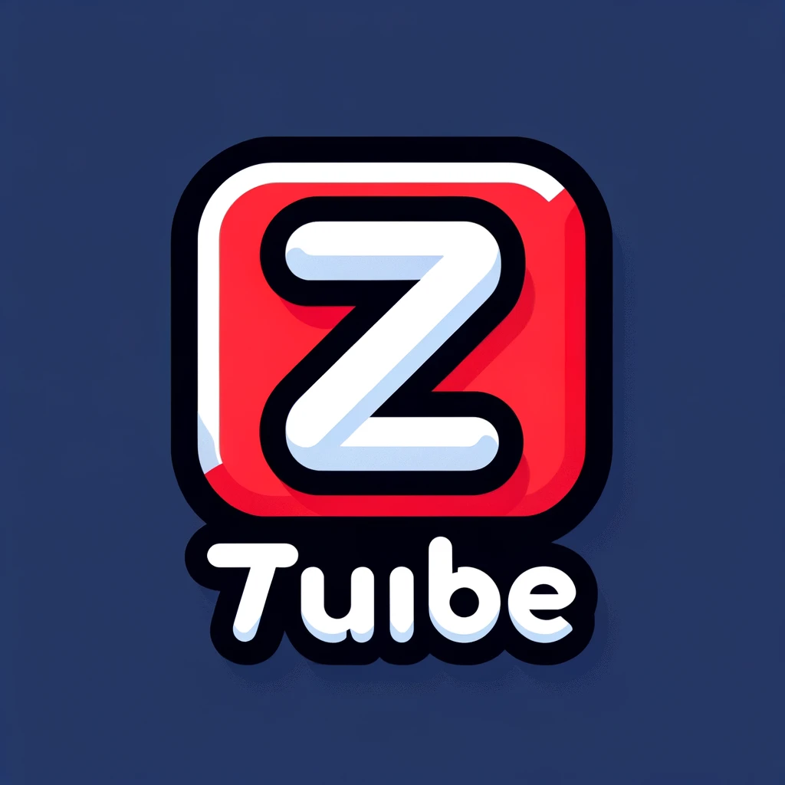
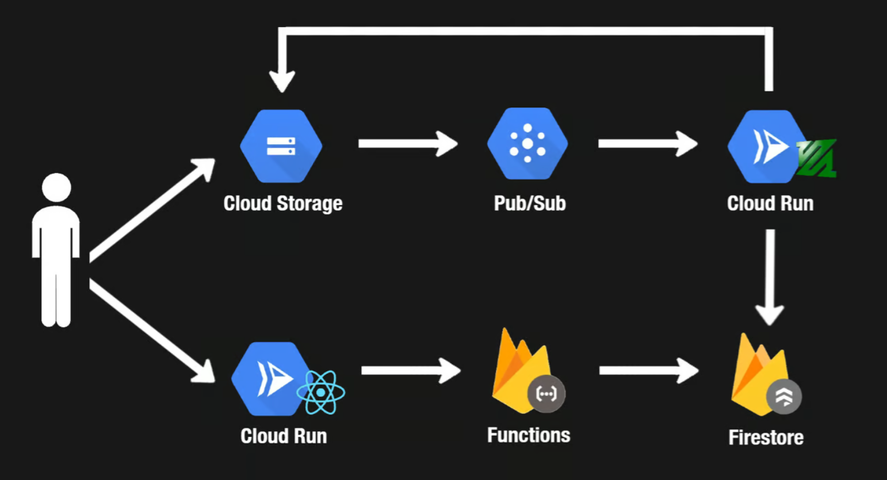

# Ztube Design Doc

# Introduction

The goal of this project is to build a simple full-stack application which implements the core functionality of Youtube. The focus of this project is on learning, not building a production ready system and exploring the complexities of using cloud technologies (GCP in this scenario) to upload and view videos. I will list the project requirements below.

# Requirements

- Users can sign in/out using their Google account(gmail)
- Users can upload videos while signed in
- Videos should be transcoded to multiple formats (e.g 360p)
- Users can view a list of uploaded videos (signed in or not)
- Users can view individual videos(regardless of whether they are signed in or not)

# High Level Design

## Video Storage(Cloud Storage)

Google Cloud Storage will be used to host the raw and processed videos. This is a simple, scalable, and cost effective solution for storing and serving large files.

## Video Upload Events(Cloud Pub/Sub)

When a video is uploaded, we will publish a message to a Cloud Pub/Sub topic. This adds a durability layer for video upload events and process videos asynchronously.

## Video Processing Workers (Cloud Run)

When a video upload event is published, a video processing worker will receive a message from Pub/Sub and transcode the video. For transcoding the video we will use ffmpeg, which is a popular open source tool for video processing and it's widely used in the industry(including at YouTube).

The nature of video processing can lead to inconsistent workloads, so Cloud Run will be used to scale up and down as needed. Processed videos will be uploaded back to Cloud Storage.

## Video Metadata (Firestore)

After a video is processed, we will store the metadata in Firestore. This will allow us to display processed videos in the web client along with other relevant info (e.g title, description, etc).

## Video API (Firebase Functions)

Firebase Functions will be used to build a simple API that allows users to upload videos and retrieve video metadata. This can easily be extended to support additional Create, Read, Update, Delete (CRUD) operations.

## Web Client (Next.js/Cloud Run)

Next.js will be used to build a simple web client that will allow users to sign in and upload videos. The web client will be hosted on Cloud Run.

## Authentication (Firebase Auth)

Firebase Auth will be used to handle user authentication, which allows us to easily integrate with Google Sign in.
